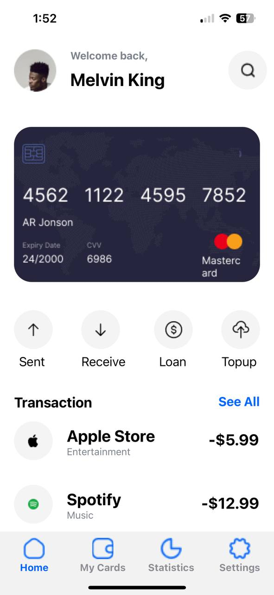
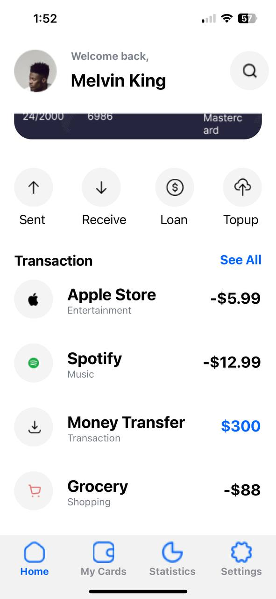
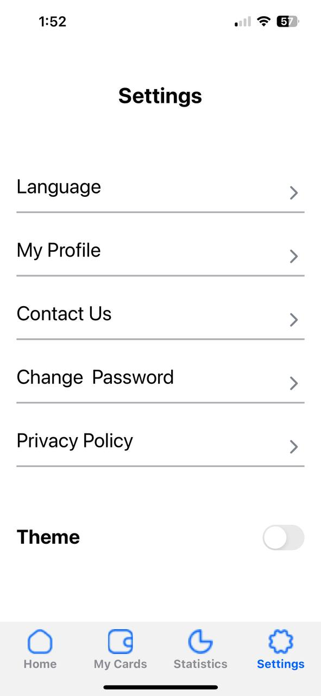
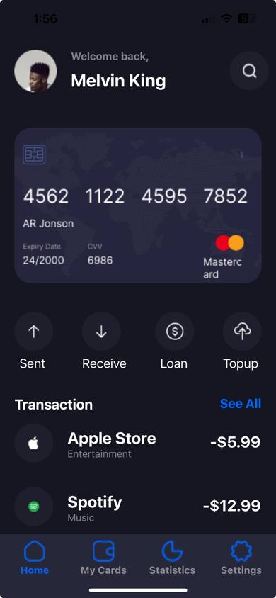
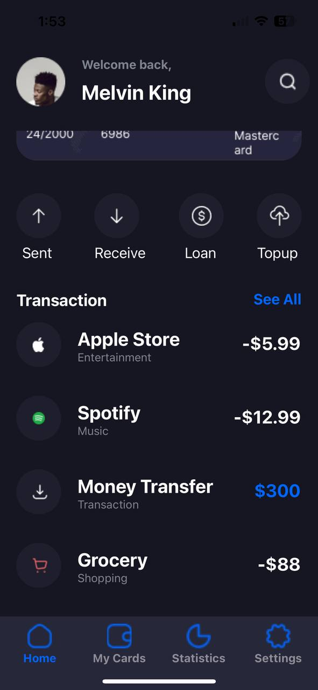
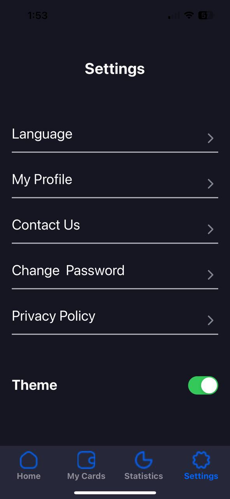

# STUDENT ID: 11024275

## DESCRIPTION OF APP BUILDING PROCESS

### HOMESCREEN

- The home header component was created
- The card image was then placed right after
- The send, receive, loan and topup buttons were created right after
- The past transactions were created and placed dynamically with the use of props

### SETTINGS SCREEN

- The Settings label was introduced
- The *language*, *my profile*, *contact us*, *change password* and *privacy policy* sections were introduced after with a divisor between them
- The *theme* changer was introduced with the use of the **Switch** component
- The use of the **useState**, **useContext** and **createContext** componets were used in the following files to change the theme of the application on user toggle:
    * theme.js
    * ThemeContext.js
    * App.js
    * Home.js
    * Settings.js

### TAB BAR

- The tab bar section was created with the use of the **createBottomTabNavigator** component
- The icons used to represent the tabs were reprsented with imported images

## SCREENSHOTS OF APPLICATION

### LIGHT THEME

### DARK THEME

